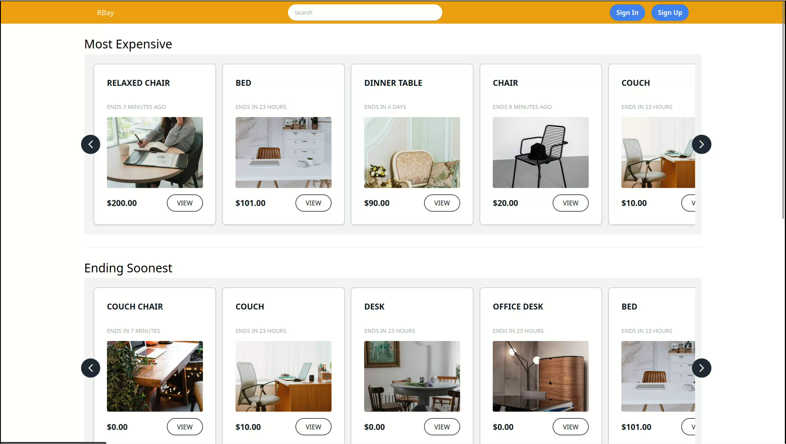

## 🛒 Auction Platform (Inspired by eBay)

Designed and developed a dynamic **real-time auction platform** inspired by eBay.

### 🔧 Key Features

#### 🧑‍💼 For Sellers:
- List products with images and descriptions  
- Set custom auction timers  
- Track real-time bidding activity  
- View analytics:
  - Product views  
  - Interactive bid history

#### 🛍️ For Buyers:
- Place **live bids** with instant updates  
- Monitor ongoing auctions in real time  
- Automatic bid updates via WebSockets

---

### 🧰 Tech Stack

- **Frontend:** Svelte  
- **Backend:** Node.js, Express  
- **Database:** MongoDB  
- **Real-time:** Redis Pub/Sub  
- **Authentication:** OAuth2  
- **State Management:** Svelte Stores  
- **Scripting:** Lua (for atomic Redis operations)  
- **No deployment** (currently local for development/testing)

---

> 📽️ Watch Rbay in action:

> _Click the image above to watch the full demo on Google Drive._

---

### 🎯 Outcome
Created a smooth, interactive auction experience with **real-time data**, **secure login**, and a **reactive UI**. The combination of Redis caching and Lua scripting significantly enhanced system responsiveness and data consistency.

> Focused on performance, modularity, and real-time responsiveness using modern web technologies.
